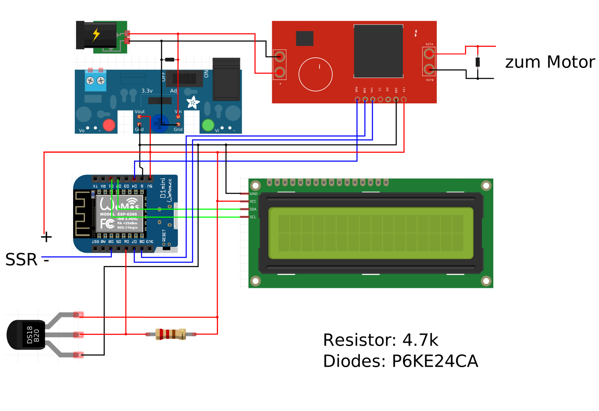

# Brauhelferlein

Automatisierung des Maische Kochens mit minimalem Aufwand und lediglich eines ESP 8266 eigenständig für keine 10€.

## Highlights

- Temperatur PID Regelung auf zehntel Grad genau
- Rührwerk Drehzahlregelung
- Rührwerk Interwall Steuerung
- Graphen für Temperatur Verlauf
- Rast Zeit Erkennung
- Verwendet Wifi Zugang oder stellt eigenen AP bereit
- Web Flash Update

### Screenshot

## Anleitung

### Benötigt wird

- ein ESP8266 (D1 mini oder ESP-12E)
- ein Relais oder SSR
- ein DS18b20 Messfühler
- zur Steuerung des Maische Rührwerks (Scheibenwischermotor) einen Motor Treiber zB. VNH2SP30
- optional ein Display (LCD I2C 1602).

### Verkabelung

### Software

- Arduino 1.6.x
- erweitern mit [ESP8266 Arduino](https://github.com/esp8266/Arduino)
- Installiere libraries
  - OneWire.h
  - DallasTemperature.h
  - NewLiquidCrystal https://bitbucket.org/fmalpartida/new-liquidcrystal/wiki/Home
  - PID_v1.h
  - ArduinoJson.h

Enjoy your beer! :)
